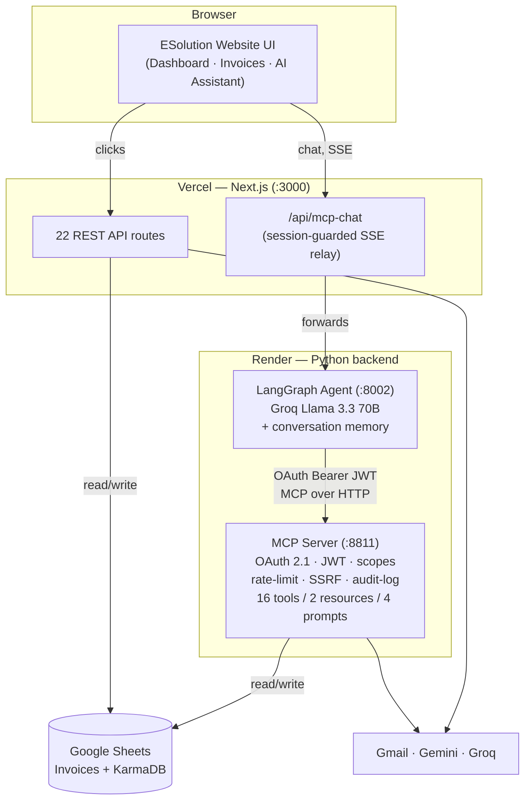
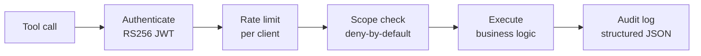

# ESolution — AI-Powered Invoicing Platform

> An invoicing web app for freelancers where a natural-language AI assistant can **read, create, and manage real invoices** — turning 7 manual clicks into one sentence. The assistant runs through a **production-grade MCP server** secured with OAuth 2.1, RS256 JWTs, per-tool scopes, rate limiting, and audit logging.

<p align="center">
  <a href="#"></a>
  
  
  
  
</p>

**🔗 Live demo:** _add your Vercel URL here_ &nbsp;·&nbsp; **🎥 Demo video:** _add your Loom/YouTube link here_

---

## Overview

Freelancers juggle invoicing across a dashboard, an email client, and mental math: create an invoice, email it, chase late payers, judge whether a client is trustworthy, calculate late penalties, write a LinkedIn post after getting paid. **ESolution** collapses all of that into a chat box.

The interesting engineering isn't "it calls an LLM." It's **how the AI safely gets write access to a real production system** without becoming a security hole. The AI talks to a separate **MCP (Model Context Protocol) server** as a properly authenticated API client — every tool call is authenticated, authorized by scope, rate-limited, validated, and audit-logged. Only ~8.5% of public MCP servers implement OAuth at all; this one treats security as the core feature.

> _"Create an invoice for Rahul, ₹50,000, due in 15 days"_ → the agent checks the client's payment history, computes the due date, writes the row to Google Sheets, and hands back a payment link — live, in one message.

---

## Features

- **💬 Natural-language invoice management** — create, list, filter, mark paid, and remind, all by chatting. Streams responses live (SSE) with a transparent card for every tool the AI runs.
- **🔐 Security-hardened MCP server** — OAuth 2.1 client-credentials + RS256 JWT (audience/issuer bound), 8 deny-by-default permission scopes, token-bucket rate limiting, SSRF guard, input validation, and structured audit logging on **every** tool call.
- **📊 Live dashboard** — outstanding / overdue / revenue at a glance, with status, days-overdue, and late penalties recomputed from raw data on every read (never trusted from storage).
- **⭐ Client "Karma" reputation** — privacy-preserving (MD5-hashed emails) 0–5 star scoring from payment history; the AI warns before invoicing a risky client.
- **📧 Emotion-aware reminders** — tone picked from AI sentiment analysis or day-based tiers (gentle → firm → urgent → legal), with a bulk "overdue sweep" that respects throttles.
- **🧾 Documents** — Puppeteer-generated PDF invoices & completion certificates; Groq-written LinkedIn posts for paid projects; Gemini-drafted legal notices (gated to 30+ days overdue).
- **✅ 119 automated tests** covering JWT/auth, scopes, SSRF, rate limiting, input validation, and cross-language business-logic parity.

---

## Architecture

Three independent processes share one Google Sheet as the source of truth. The website and the MCP server are **co-tenants** of the same spreadsheet — the AI never calls the website's cookie-protected API routes.



**The security chain runs on every single tool call:**



---

## Tech Stack

| Layer | Technology |
|---|---|
| **Frontend** | Next.js 16 (App Router), React 19, NextAuth v4 (Google OAuth), Framer Motion, styled-jsx |
| **AI agent** | LangGraph, Groq Llama 3.3 70B, langchain-mcp-adapters, FastAPI (SSE) |
| **MCP server** | FastMCP, OAuth 2.1 + RS256 JWT (PyJWT), pydantic-settings, structlog |
| **Data & services** | Google Sheets (gspread / google-spreadsheet), Gmail (smtplib / Nodemailer), Gemini 2.0 Flash, Puppeteer (PDF/certificates) |
| **Testing** | pytest, pytest-asyncio — 119 tests |
| **Deploy** | Vercel (website) · Render (Python backend) |

---

## Folder Structure

```
esolution-invoice-ai/
├── src/                          # Next.js website
│   ├── app/
│   │   ├── dashboard/            # invoice dashboard
│   │   ├── invoices/             # create / view invoices
│   │   ├── ai-assistant/         # AI chat page
│   │   ├── pay/ · portal/        # client-facing payment pages
│   │   └── api/                  # 22 REST routes (+ /api/mcp-chat relay)
│   ├── components/               # Sidebar, ChatInterface, ToolCallCard, StatsCards…
│   └── lib/                      # sheets.js, email.js, gemini.js, karma-calculator.js…
│
└── project_2/                    # Python AI backend
    ├── mcp-server/
    │   └── src/
    │       ├── server.py         # FastMCP entry point
    │       ├── auth/             # OAuth server, JWT handler, scopes, middleware
    │       ├── security/         # rate limiter, SSRF guard, input validator, audit logger
    │       ├── sheets/           # gspread client + invoice/karma models (mirror sheets.js)
    │       ├── services/         # Gmail, Gemini, Groq
    │       └── tools/            # 16 invoice-domain MCP tools
    ├── agent/                    # LangGraph agent + FastAPI SSE API
    ├── start.sh                  # runs both Python services (Render)
    └── render.yaml               # Render blueprint
```

---

## Setup (local)

**Prerequisites:** Node 20+, Python 3.11+, a Google service account with Sheets access, a Gmail App Password, and free API keys from [Groq](https://console.groq.com) and [Google AI Studio](https://aistudio.google.com).

### 1. Website

```bash
git clone https://github.com/Eeshan842004/esolution-invoice-ai.git
cd esolution-invoice-ai
npm install
cp .env.example .env.local      # fill in your values
npm run dev                     # → http://localhost:3000
```

### 2. AI backend (for the chat page)

```bash
cd project_2
python -m venv .venv
.venv/Scripts/pip install -e mcp-server -e agent   # (.venv/bin/pip on macOS/Linux)
bash scripts/generate_keys.sh                       # RSA keys for JWT signing

# terminal 1 — MCP server (:8811)
cd mcp-server && ../.venv/Scripts/python -m src.server http

# terminal 2 — agent (:8002)
cd agent && ../.venv/Scripts/python -m uvicorn src.api:app --port 8002
```

The MCP server and agent read the repo-root `.env.local` automatically. Run the tests with `cd project_2/mcp-server && ../.venv/Scripts/python -m pytest` (119 passing).

---

## Deployment

The app is **two hosting targets** — the website works fully on Vercel alone; the Python backend on Render only powers the AI-chat page.

### Website → Vercel
1. Import the repo at [vercel.com](https://vercel.com) (auto-detects Next.js).
2. Add every variable from [`.env.example`](.env.example). Set `NEXTAUTH_URL` and `NEXT_PUBLIC_BASE_URL` to your Vercel domain.
3. In Google Cloud Console, add `https://<your-app>.vercel.app/api/auth/callback/google` to the OAuth client's **Authorized redirect URIs**.
4. Deploy.

### Python backend → Render
1. New **Web Service** → root directory `project_2`, build `pip install -e mcp-server -e agent`, start `bash start.sh`, health check `/health`. (A [`render.yaml`](project_2/render.yaml) blueprint is included.)
2. Add the Google / Gmail / Groq / Gemini env vars + a strong `OAUTH_CLIENT_SECRET`.
3. Copy the service URL into the website's `AGENT_URL` on Vercel and redeploy.

> Render's free tier sleeps after 15 min idle → the first AI message after a nap takes ~40s to wake.

---

## Screenshots

| Dashboard | AI Assistant |
|---|---|
| _`docs/screenshot-dashboard.png`_ | _`docs/screenshot-ai-chat.png`_ |

| Create Invoice | Tool-call transparency |
|---|---|
| _`docs/screenshot-new-invoice.png`_ | _`docs/screenshot-toolcards.png`_ |

> _Replace the placeholders above with real screenshots (drag an image into a GitHub issue to get a hosted URL, or commit them under `docs/`)._

---

## Demo Video

> 🎥 _Add a 60–90s walkthrough here (Loom / YouTube): create an invoice by chatting → check client karma → send a reminder → generate a LinkedIn post._

---

## License

[MIT](LICENSE) © Eeshan
